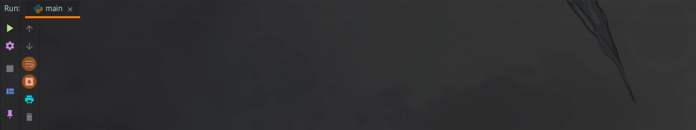
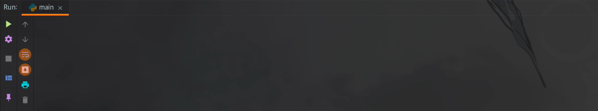

Likelion Apply Crawler Project
===

## 요약

[멋쟁이 사자처럼 9기 지원페이지](https://apply.likelion.org)에 지원한 지원자의 정보를 크롤링하여 정리

## 데모

### 성공



### 실패



## 실행 전

1. Chrome 버전에 맞는 [ChromeDriver](https://chromedriver.chromium.org/downloads) 를 `./`에 다운
2. `secrets.json`에 다음 정보를 작성
    + `ADMIN_ID`: 관리자 아이디
    + `ADMIN_PASSWORD`: 관리자 비밀번호
    + `EXCLUDES`: 제외할 사람들 이름 _(없다면 빈 리스트)_
    + `QUESTIONS`: 질문 목록 _(질문 번호는 제외)_
    + `EMAIL`: 발신 이메일 *(Gmail)*
    + `EMAIL_PASSWORD`: Gmail 비밀번호 *(Gmail 2중 인증 사용 시 앱 비밀번호)*
    + `EMAIL_FROM`: 질문 목록 _(질문 번호는 제외)_

### `secrets.json` 작성 예시

```json
{
  "ADMIN_ID": "00@likelion.org",
  "ADMIN_PASSWORD": "xxxxxxxx",
  "EXCLUDES": [
    "김길동",
    "박길동"
  ],
  "QUESTIONS": [
    "질문",
    "질문",
    "질문",
    "질문",
    "질문"
  ],
  "EMAIL": "XXX@likelion.org",
  "EMAIL_PASSWORD": "xxxxxxx",
  "EMAIL_FROM": "멋쟁이사자처럼 X 명지대(서울)"
}
```

## 실행 방법

1. `git clone https://github.com/likelionmju/apply_crawling.git`
2. `python3 -m venv venv`
3. mac OS: `source venv/bin/activate`  
   Windows: `venv/Scripts/activate`
4. `pip install -r requirements.txt`
5. `python src/main.py`

## 크롤링 작동 순서
1. 프로그램 시작 시 `1`입력


2. [멋쟁이 사자처럼 9기 지원페이지](https://apply.likelion.org)에 로그인
   ```python
   def login(admin_id: str, admin_password: str, with_headless: bool = True) -> dict:
      ...
   ```
3. 일부 제외할 사람 외에 모든 지원자 정보 취합
   ```python
   def request_univ_page_source(univ_code: str, login_info: dict) -> str:
        ...
   
   def extract_all_applicant_pks(univ_page_source: str) -> list:
        ...
   
   def request_applicant_source(applicant_pk: str, login_info: dict) -> str:
        ...
   
   def parse_applicant_page(page: str, q_count: int) -> Applicant:
        ...
   ```
4. 지원자가 제출한 휴대폰 번호가 `000-0000-0000`의 형식을 따르지 않는 경우,  
   변경
   ```python
   applicant.format_phone_num()
   ```
5. `../지원자 서류/`내에 지원자 별로 `학과_학번_이름`폴더 생성
   ```python
   if not applicant.root_dir.exists():
        applicant.root_dir.mkdir()
   ```
6. 지원자가 별도의 파일을 제출했다면, 파일을 다운로드
   ```python
   def download_applicant_file(applicant: Applicant) -> None:
        ...
   ```
7. 파일의 확장자가 `.zip` 이면,  
   `../지원자 서류/학과_학번_이름/시간표 및 포트폴리오/`에 압축해제
   ```python
   def unzip(target: Path, to) -> None:
        ...
   ```
8. 다운로드한 파일의 확장자가 `.png`, `.jpg`, `.jpeg`인 경우,  
   파일명을 시간표로 변경
   

9. 다운로드한 파일의 확장자가 `.pdf`, `.docx`, `.hwp`인 경우,  
   파일명을 포트폴리오로 변경
   ```python
   def reformat_file(file: Path) -> None:
        ...
   ```
10. 지원자의 정보를 개인별 폴더 내에 `지원서.docx`로 정리
   ```python
   def export_docx(applicant: Applicant) -> None:
        ...
   ```

### `.docx` 출력 예시

```text
이름: 홍길동
입학 년도: 2018년
전공: 국어국문학과
전화번호: 010-0000-0000
이메일: gildong@gildong.com
GitHub: X
SNS: X

1. 질문
답변

2. 질문
답변

3. 질문
답변

4. 질문
답변

5. 질문
답변
```


11. 지원자의 정보를 `../applicant/[이름].pkl`로 저장


12. 모든 지원자의 정보를 `.xlsx`로 정리 _(전공으로 오름차순 정렬)_
      ```python
      def gathering_applicant_data(applicants: list):
        ...
      ```


### `.xlsx`출력 예시
#|이름|입학 년도|전공|전화번호|이메일|GitHub|SNS|합격  
---|---|---|---|---|---|---|---|---
1|홍길동|2018년|국어국문학과|010-0000-0000|gildong@gildong.com|X|X|TRUE
    
## 정보 복원 작동 순서
1. 프로그램 시작 시 `2`입력


2. 정보를 복원할 지원자의 이름을 입력


3. 지원자의 정보를 출력


## 합격 처리 작동 순서
1. 프로그램 시작 시 `3`입력


2. 합격 처리할 지원자들의 이름을 공백으로 구분하여 입력
   + ex) 홍길동, 이길동을 합격처리 시 `홍길동 이길동`으로 입력
   
## 메일 발송 작동 순서
1. 프로그램 시작 시 `4`입력


2. `.pkl`파일을 기준으로 메일을 발송


## 메일 사용 방법
`./data/`폴더를 생성 후 내부에 `fail_subject`, `fail_text`, `pass_subject`, `pass_text`파일을 작성한다.

- `fail_subject`: 탈락자 발송 메일 제목
- `fail_text`: 탈락자 발송 메일 내용
- `pass_subject`: 합격자 발송 메일 제목
- `pass_text`: 합격자 발송 메일 내용

`Markdown`으로 작성 시 `.html`로 변환 후 발송


## 사용 라이브러리

- `beautifulsoup4 v4.9.3`
- `pathos v0.2.7`
- `python-docx v0.8.10`
- `requests v2.25.1`
- `selenium v3.141.0`
- `yaspin v1.4.1`
- `openpyxl v3.0.6`
- `pandas v1.2.3`

## 개발 환경

- `IntelliJ IDEA 2020.3.2 (Ultimate Edition)`
- `macOS Big Sur v11.2.2`
- `python 3.8.5`

## 기타

- `Pipe-and-Filter` 사용
- `pathos.multiprocessing`으로 Multiprocessing 구현
- 압축된 파일에 한글이 포함되어 있는 경우, 파일 명이 깨지는 것을 방지

## 만든 사람

- [AiRini](https://github.com/ygnaiih1680) 명지대학교 융합소프트웨어학부 응용소프트웨어전공 18학번 

